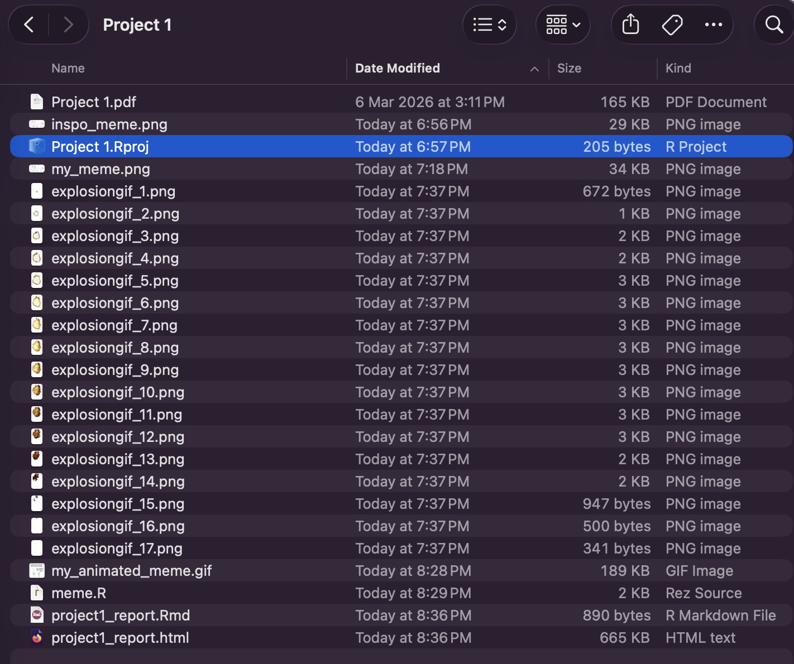
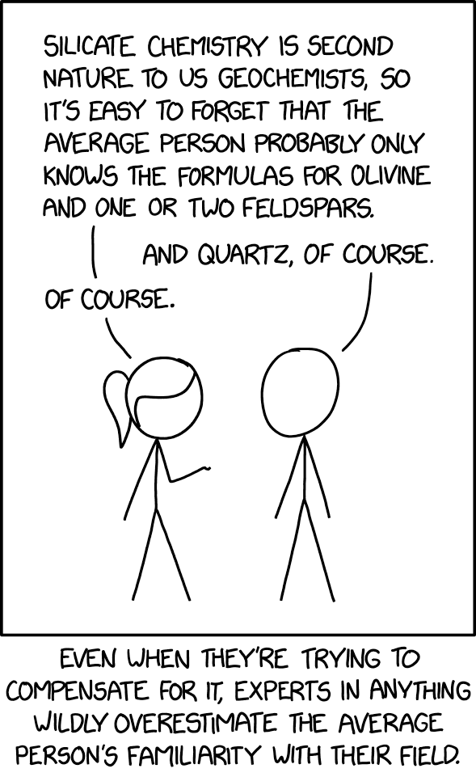
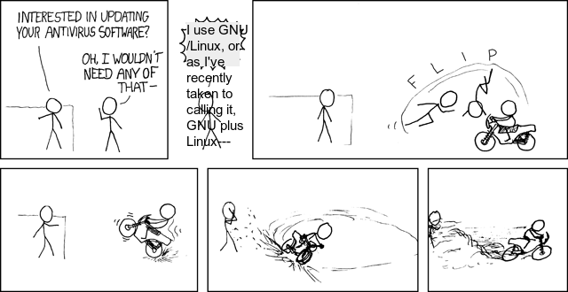
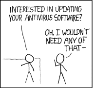

```{r setup, include=FALSE}
knitr::opts_chunk$set(echo=TRUE, message=FALSE, warning=FALSE, error=FALSE)
```

```{css}
@import url('https://fonts.googleapis.com/css2?family=Cal+Sans&family=Micro+5&family=Special+Gothic+Expanded+One&display=swap');
body {
  background: linear-gradient(138deg,rgba(187, 223, 250, 1) 0%, rgba(117, 255, 175, 1) 50%, rgba(220, 255, 204, 1) 100%);
  
}

h1, h2, h3, .author {
  font-family: "Cal Sans", sans-serif;
  padding: 10px;
}

div:not([class="container-fluid main-container"]) { 
/* I thought it was strange that R Studio had Chrome's HTML inspector, but it turned out to be useful for getting that class name */
  background: rgba(255, 255, 255, 0.5);
  backdrop-filter: blur(10px);
  border-radius: 10px;
}

p {
  padding: 10px;
}


```

## Project requirements

[my github repo](https://github.com/Austin-540/stats220)

## Inspo meme


The key component of this meme is the proud linux user saying something in response to the employee asking about antiviruses. The meme uses multiple panels. 


## My meme


To change the original comic, I covered up the text saying "I run linux" using a white box, then I added my own (more pedantic) text on top of it. I made this change to represent the complexities of the word "Linux" which are often brought up in discussions online. I have kept the base image the same. 

## My animated meme 


## Creativity
I think my project demonstrates creativity because:

* My animated meme adds another gif into one of the frames of my meme. 
* To get each panel of the comic I used `image_crop()`, which was not in the lab.
* To put the explosion frames on top of panel 6 I used `image_composite()`, which was not in the lab.
* Using a gradient background in the CSS, and a white-blur background for each section to make my report look more interesting.


## Learning reflection


## Appendix

<mark>Do not change, edit, or remove the `R` chunk included below.</mark> 

If you are working within RStudio and within your Project1 RStudio project (check the top right-hand corner says "Project1"), then the code from the `meme.R` script will be displayed below.

This code needs to be visible for your project to be marked appropriately, as some of the criteria are based on this code being submitted.


```{r file='meme.R', eval=FALSE, echo=TRUE}

```

