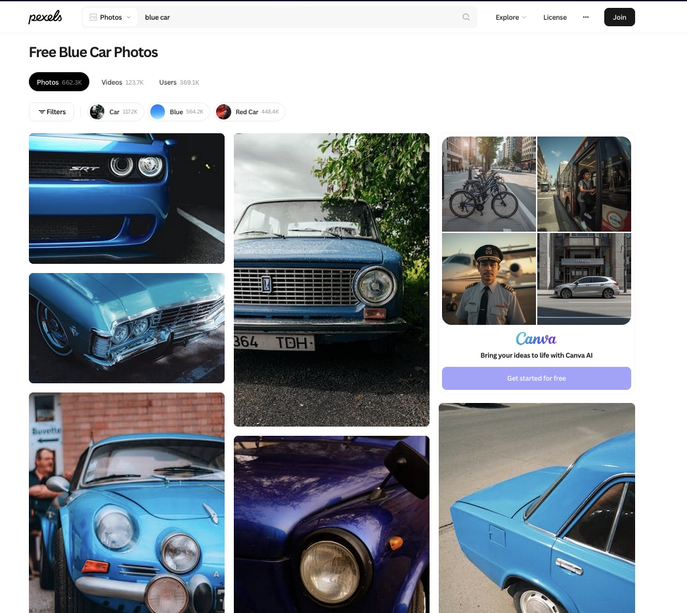

```{css echo=FALSE}
@import url('https://fonts.googleapis.com/css2?family=Cal+Sans&family=Micro+5&display=swap');

.author, .title, .subtitle, h2 {
    background: linear-gradient(90deg,rgba(131, 58, 180, 1) 0%, rgba(252, 69, 124, 1) 100%);
    background-clip: text;
    color: rgba(0,0,0,0);
    background-size: 100% 100%;
    background-repeat: no-repeat;
    display: block;
    width: max-content;
    margin: 0px 0px 10px 0px;
}

.title {
  font-size: 50px;
  text-shadow:
    0 2px 6px rgba(252,69,124,0.25),
    0 6px 18px rgba(131,58,180,0.18);
} /* Its kinda subtle */

body {background: #EEEEEE;} 
.author {font-family: "Micro 5", sans-serif;display: block;
  width: max-content;}
h1, h2, h3 {font-family: "Cal Sans", sans-serif;display: block;
  width: max-content;}

div.section:not(#my-selected-photos, #the-3-things-i-noticed-about-the-photos-were), div#header {
  background: rgba(255, 255, 255, 0.8);
  border-radius: 10px; 
  padding: 20px;
  margin: 20px;
  box-shadow: 8px 7px 7px #AAA
}

/* Fun fact: I started the CSS for this before I started revising for the test */
```

```{r setup, include=FALSE}
knitr::opts_chunk$set(echo=TRUE, message=FALSE, warning=FALSE, error=FALSE)
library(tidyverse)
selected_photos <- read_csv("selected_photos.csv")
```

## Introduction
I used the words "blue car" because I started this assignment on a bus and the first thing I saw looking out the window was a blue car (I'm so creative). 

[https://www.pexels.com/search/blue%20car/](https://www.pexels.com/search/blue%20car/)




### The 3 things I noticed about the photos were:

* The majority of photos seemed to be of older cars instead of more modern cars which are more common to see in person.

* There seemed to be a roughly equal proportion of portrait and landscape photos.

* Most of the photos that I looked into had between 0 and 10 hearts, where 0 was the most common number of hearts that I saw.


### My selected photos:
`r selected_photos %>% select(url) %>% knitr::kable()`


## Key features of my selected photos

```{r, eval=TRUE}
percent_blue <- mean(selected_photos$main_colour == "blue") %>%
  round(digits=3) * 100
```

**`r percent_blue`%** of the photos I selected had more blue than red or green.

```{r, eval=TRUE}
proportion_blue_portrait <- selected_photos %>% 
  group_by(is_portrait) %>%
  summarise(proportion_blue = mean(main_colour == "blue"))

proportion_blue_not_portrait <- proportion_blue_portrait$proportion_blue[1]
percent_blue_not_portrait <- round(proportion_blue_not_portrait, digits=3) * 100
```

**`r percent_blue_not_portrait`%** of the selected non-portrait photos have more blue than red or green.

```{r, eval=TRUE}
mean_num_author_words_by_is_portrait <- selected_photos %>%
  group_by(is_portrait) %>%
  summarise(mean_words_in_author = mean(words_in_photographers_username))

non_portrait_mean_words <- mean_num_author_words_by_is_portrait$mean_words_in_author[1]

difference <- round(mean_num_author_words_by_is_portrait$mean_words_in_author[1] - mean_num_author_words_by_is_portrait$mean_words_in_author[2], digits=3)

```

Of the non-portrait photos, the average photographer username had **`r non_portrait_mean_words`** words.

In the selected photos, the usernames of the photographer had **`r difference`** fewer words on average if the photo was portrait.


## Creativity
This is a new section

## Learning reflection
This is a new section

## Appendix
```{r file='exploration.R', eval=FALSE, echo=TRUE}

```
```{r file='project3_report.Rmd', eval=FALSE, echo=TRUE}

```