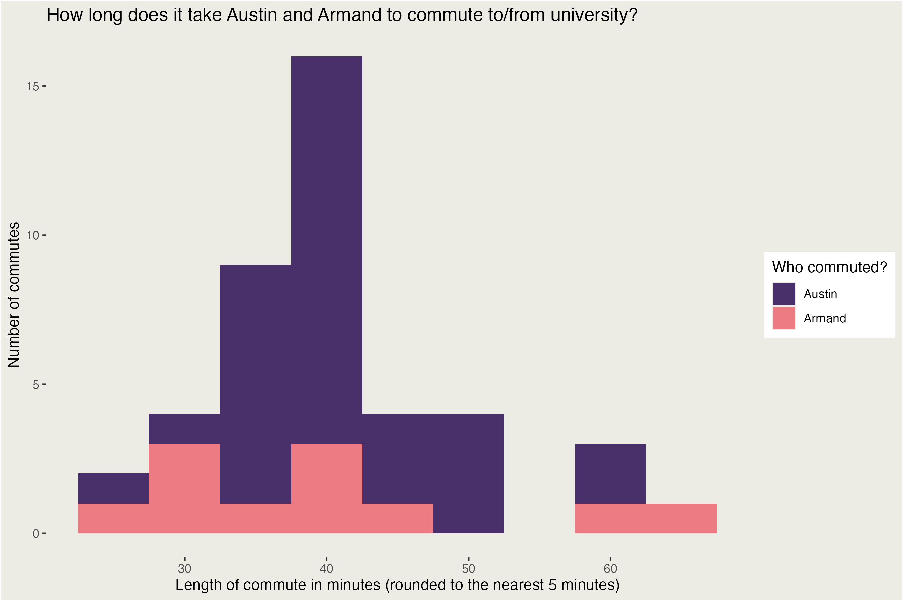
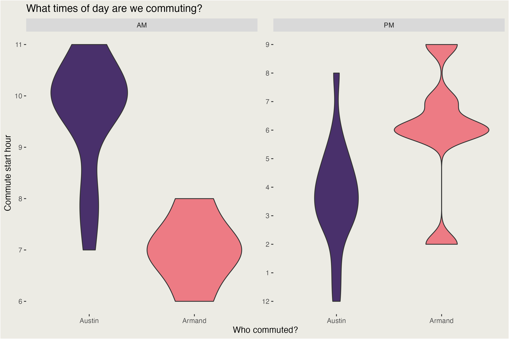
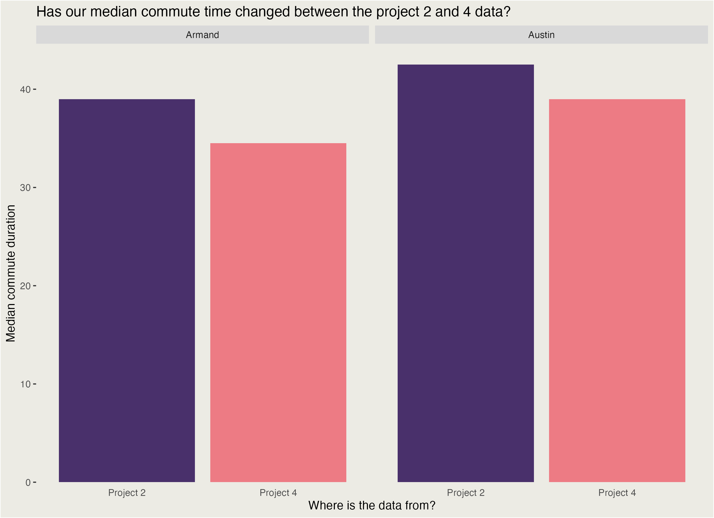

<script src="https://code.jquery.com/jquery-3.7.1.min.js" integrity="sha256-/JqT3SQfawRcv/BIHPThkBvs0OEvtFFmqPF/lYI/Cxo=" crossorigin="anonymous"></script>

```{r setup, include=FALSE}
knitr::opts_chunk$set(echo=FALSE, message=FALSE, warning=FALSE, error=FALSE)
```

```{js}
//A whole new world of possibilities with JS

$(function() { 
  $(".level2").css('visibility', 'hidden');
  $(".level2").first().css('visibility', 'visible');
  $(".container-fluid").height($(".container-fluid").height() + 300);
  $(window).on('scroll', function() {
    $('h2').each(function() {
      var h2Top = $(this).offset().top - $(window).scrollTop();
      var windowHeight = $(window).height();
      if (h2Top >= 0 && h2Top <= windowHeight / 2) {
        $(this).parent('div').css('visibility', 'visible');
      } else if (h2Top > windowHeight / 2) {
        $(this).parent('div').css('visibility', 'hidden');
      }
    });
  });
})
```

```{css}
.figcaption {display: none}
body {
  background: #ECEBE4;
}

@import url('https://fonts.googleapis.com/css2?family=Cal+Sans&family=Micro+5&display=swap');

.author, .title, .subtitle, h2 {
    margin: 0px 0px 10px 0px;
}

.title {
    color: #FFF !important;
}

h1, h2, h3 {font-family: "Cal Sans", sans-serif;display: block; color: #49306B;}

img {
  border-radius: 10px;
}

div#header {
  background: #49306B !important;
  border-radius: 10px; 
  padding: 20px;
  margin: 20px;
}

div.section {
  background: rgba(255, 255, 255, 0.8);
  border-radius: 10px; 
  padding: 20px;
  margin: 20px;
  
  animation: slideIn ease-in-out both;
  animation-timeline: view();
  animation-range: entry 10% entry 30%;
  
}

html {
overflow-x: hidden;
}

.figcaption {
  color: #777;
}
```

## What does this data represent?
Armand and I have tracked how long it takes for us to get to and from university. Armand commutes by car, and I commute by bus. For each commute we did, we tracked what method we used, how many minutes it took, and what time we started. 

There is more data for me than Armand because Armand got sick for a bit so had no commutes to record 😞


## How frequently does each journey length happen?



The most frequent overall journey time is 40 minutes (rounded to the nearest 5 minutes), and the rest of the times drop in frequency the further they get from 40 minutes.

It looks like Armand and I have quite different commute time patterns, where mine is quite varied and his is a bit more consistent. 

I wonder if we tend to commute at different times of the day? Maybe that could explain the variability.

## So what times of day do we commute?


Looks like my commutes in the morning happen over a much wider timeframe than Armand's. It also looks like in the evening Armand quite frequently commutes home at 6PM, whereas I have a much more varied commute home start hour.

## But did our commutes get longer or shorter for this project?

Project 2's data collection was mostly in late March, whereas Project 4's data was from late April/early May. 

According to AT, March is the busiest time of year for public transport. Lets see if we can see a decrease in commute duration in project 4 data.


The data for both Armand and me shows that our median commutes are shorter in the Project 4 data. You can also see that for both projects my median commute takes longer than Armand's median commute.


