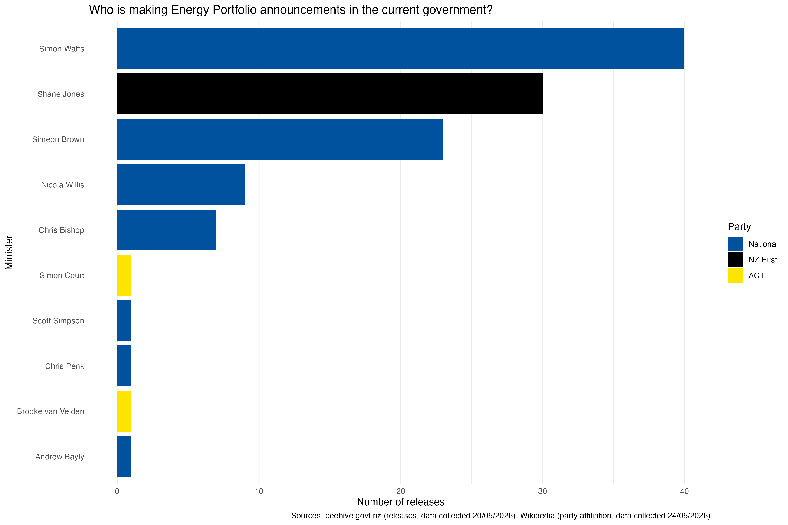

```{css echo=FALSE}
@import url('https://fonts.googleapis.com/css2?family=Cal+Sans&family=Micro+5&display=swap');

.author, .title, .subtitle, h2 {
    margin: 0px 0px 10px 0px;
}

.title {
    color: #FFF !important;
}

.author {
    color: rgba(255, 255, 255, 1);
    display: block;
    width: max-content;
    margin: 0px 0px 10px 0px;
    font-family: "Micro 5", sans-serif;display: block;
    font-size: 40px; /* I do not know why Micro 5 looks so small by default */
}

 

h1, h2, h3 {font-family: "Cal Sans", sans-serif;display: block;}

div#header {
  background: linear-gradient(123deg,rgba(255, 0, 0, 1) 0%, rgba(255, 149, 0, 1) 20%, rgba(255, 229, 0, 1) 40%, rgba(0, 255, 149, 1) 60%, rgba(0, 47, 255, 1) 80%, rgba(191, 0, 255, 1) 100%);
  border-radius: 10px; 
  padding: 20px;
  margin: 20px;
}

div.section, #header {
  background: rgba(255, 255, 255, 0.8);
  border-radius: 10px; 
  padding: 20px;
  margin: 20px;
  box-shadow: 4px 5px 10px rgb(128 128 128);
  
}

html {
overflow-x: hidden;
}

.figcaption {
  color: #777;
}


```

```{r setup, include=FALSE}
knitr::opts_chunk$set(echo = TRUE)
```

## Introduction

I decided to focus on releases related to the Energy Portfolio from the current National-ACT-NZ First government. I decided to focus on this because the Energy Portfolio is quite relevant at the moment due to the petrol shortage, and the current government is the most interesting data to me because it is still changing over time.

When using data from the beehive website, I will need to accurately reproduce the material and acknowledge the source of the content. This doesn't include any photos from the website. (Source: https://www.beehive.govt.nz/copyright)

From the robots.txt file, (assuming they intentionally used that "/"), I am allowed to automatically scrape their /search urls.

## Visualisation


The main purpose of my visualisation is to show who has been making announcements in the Energy Portfolio in the current government. It also shows which political party each minister belongs to, highlighting that National has significantly more releases than the other 2 parties who have had ministers make announcements.

## Creativity

this is a section

## Learning reflection

this is a section

## Self review

this is a section

## Appendix

```{r file='scrape_html.R', eval=FALSE, echo=TRUE}

```
```{r file='data_sources.R', eval=FALSE, echo=TRUE}

```
```{r file='visualisation.R', eval=FALSE, echo=TRUE}

```


